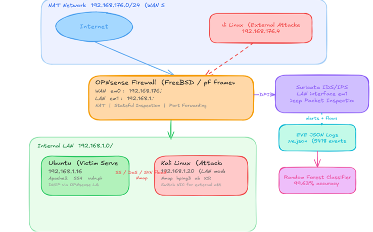
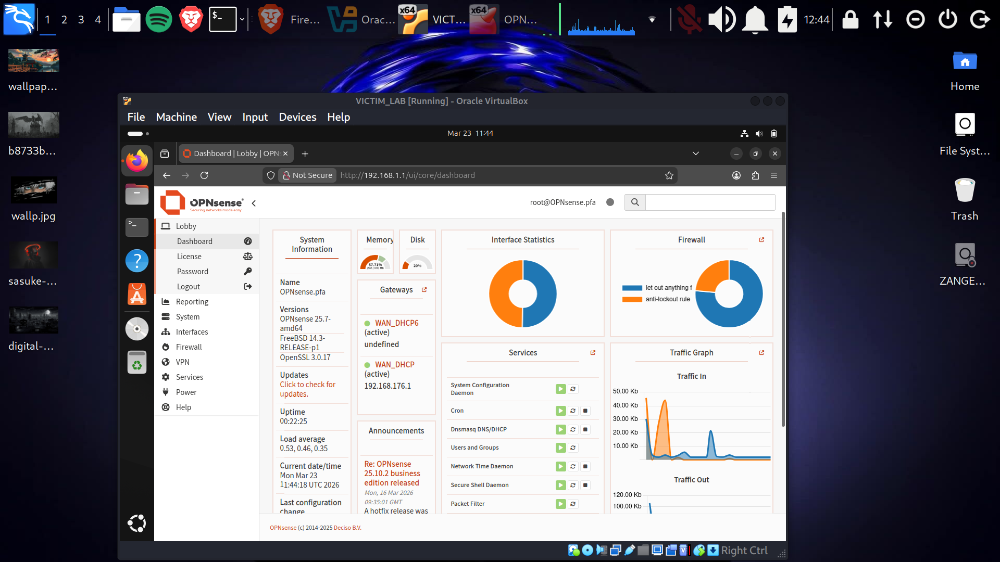
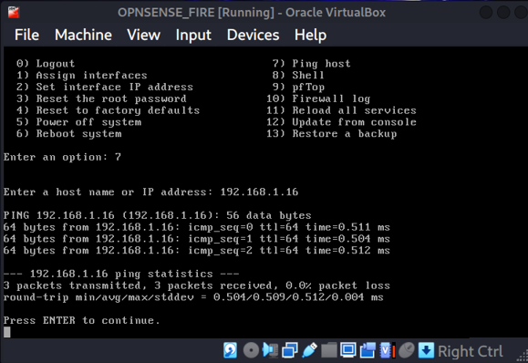
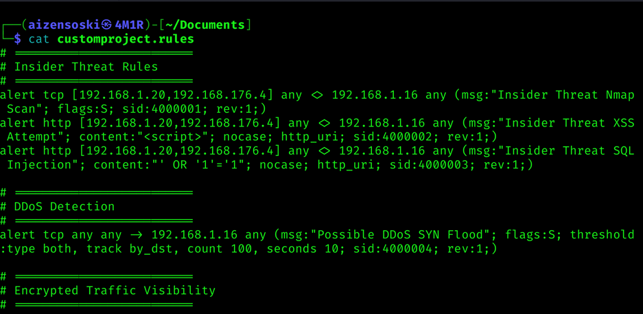
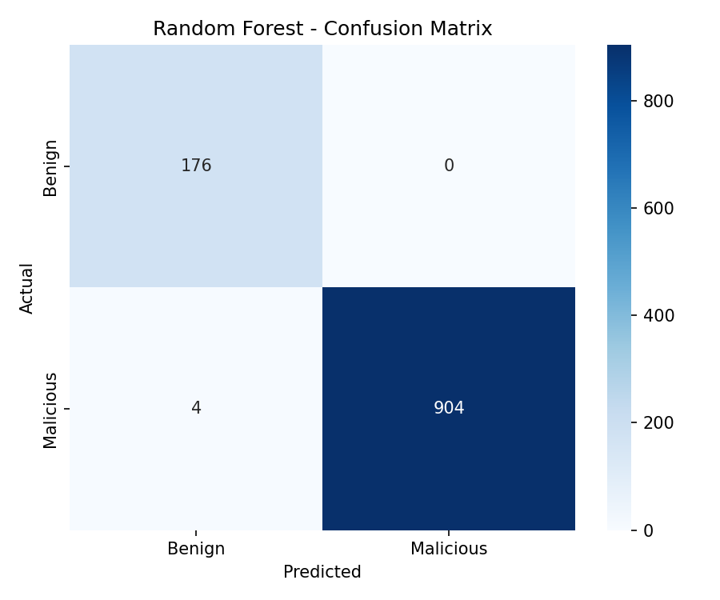

## Overview
PFA1 (Projet de Fin d'Année 1) is a first-year engineering project at ENIT focused on strengthening network intrusion detection by combining a traditional firewall/IDS stack with a machine learning classification layer.

The goal: move beyond signature-based detection alone and add a statistical layer that helps separate real attacks from background noise.

## Context & Motivation

Firewalls are good at enforcing rules you already wrote, but they can't inspect permitted traffic. In my lab, a correctly configured OPNsense firewall still let an XSS payload through without any alert. Suricata closes that gap by inspecting packet content, but it produces many alerts. A Random Forest classifier trained on labeled flow data adds a second layer that learns what normal traffic looks like.

## Architecture

The lab runs on VirtualBox with three VMs:

- **OPNsense** (192.168.1.1 LAN / 192.168.176.7 WAN): firewall and gateway
- **Ubuntu** (192.168.1.16): victim web server (Apache2 + a deliberately vulnerable PHP page)
- **Kali Linux**: attacker, used as an insider (internal network) or external attacker (NAT network)

*OPNsense web GUI, accessed from the Ubuntu VM.*

*Connectivity check from the OPNsense console: 3/3 packets received from Ubuntu.*

**Stack:**
- **OPNsense**: firewall and routing layer
- **Suricata**: signature-based IDS, network event logging (`eve.json`)
- **Python** (pandas, scikit-learn): feature engineering + model training
- **Random Forest**: final classification model

## Detection with Suricata

The default Emerging Threats ruleset didn't match my lab payloads, so I wrote custom rules for each attack scenario: Nmap scan, XSS, SQL injection and SYN flood. I also had to bind Suricata to the correct interface (LAN) before any alerts appeared.

*Custom rules written for each attack scenario.*

Attacks simulated from Kali: SYN scan (`nmap -sS`), XSS, HTTP flood (`ab`), SYN flood (`hping3`), and a CVE-2024-20353 simulation. All were detected, with 2,350 alerts in total (about 97% from the Nmap scan, which raises one alert per port).

## Data & Feature Engineering

- Dataset: 5,418 security events from Suricata's `eve.json` (4,540 malicious / 878 benign)
- 12 features extracted per event: ports, protocol, application protocol (via DPI), direction, packet/byte counts in each direction, total packets/bytes, and an upload ratio
- `signature_id` and `severity` were deliberately excluded because they directly encode the label (label leakage)
- Initially only alerts were logged, giving just 59 benign samples. Enabling **flow logging** and generating normal traffic (HTTP, DNS, SSH) added 3,000+ benign flows

## Model Training & Evaluation

Random Forest with `n_estimators=100`, `max_depth=10`, `min_samples_leaf=5`, `class_weight='balanced'`, evaluated on a 20% test split plus 5-fold cross-validation (mean F1 = 0.9966).

| Metric | Score |
|---|---|
| Accuracy | 99.63% |
| Precision | 100.00% |
| Recall | 99.56% |
| F1 Score | 99.78% |
| AUC | 1.00 |

*176 true negatives, 0 false positives, 4 false negatives, 904 true positives.*

The 4 missed attacks were single-port stealth SYN scans. The most important features were `proto_enc` and `dest_port`, followed by `app_proto_enc`.

## Challenges

- Class imbalance between benign and malicious traffic
- Feature selection: which raw fields actually mattered, and avoiding label leakage
- Building a realistic lab and generating automated attacks on 8 GB of RAM (migrated from VMware to VirtualBox)
- Suricata silently not alerting (wrong interface and unmatched rulesets)

## What I'd Improve Next

- Real-time inference instead of batch classification
- Testing against adversarial/evasive traffic
- Comparing Random Forest against XGBoost or a neural net baseline (LSTM)
- SIEM integration (Elastic Stack) for centralized monitoring

## Key Takeaways

Working on PFA1 gave me hands-on experience combining classical network security tooling with applied ML, going from raw packet logs to a trained, evaluated classifier. The near-perfect score comes with a caveat: labels were assigned by attacker IP in a controlled lab, so the model is likely learning lab-specific patterns. Real traffic would need manual labeling and far more diverse data. Understanding that gap between a high accuracy number and a production-ready system was the real lesson.
